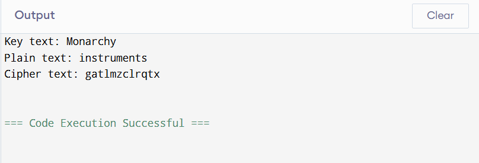

# EX-NO-02
# DATE : 18/03/2025
# PlayFair Cipher

Playfair Cipher using with different key values

## AIM:
To implement a program to encrypt a plain text and decrypt a cipher text using play fair Cipher substitution technique.

## DESIGN STEPS:
### Step 1:
Design of PlayFair Cipher algorithnm

### Step 2:
Implementation using C or pyhton code

### Step 3:
Testing algorithm with different key values.

ALGORITHM DESCRIPTION: The Playfair cipher uses a 5 by 5 table containing a key word or phrase. To generate the key table, first fill the spaces in the table with the letters of the keyword, then fill the remaining spaces with the rest of the letters of the alphabet in order (usually omitting "Q" to reduce the alphabet to fit; other versions put both "I" and "J" in the same space). The key can be written in the top rows of the table, from left to right, or in some other pattern, such as a spiral beginning in the upper-left-hand corner and ending in the centre. The keyword together with the conventions for filling in the 5 by 5 table constitutes the cipher key. To encrypt a message, one would break the message into digrams (groups of 2 letters) such that, for example, "HelloWorld" becomes "HE LL OW OR LD", and map them out on the key table. Then apply the following 4 rules, to each pair of letters in the plaintext:

1. If both letters are the same (or only one letter is left), add an "X" after the first letter. Encrypt the new pair and continue. Some
variants of Playfair use "Q" instead of "X", but any letter, itself uncommon as a repeated pair, will do.
2. If the letters appear on the same row of your table, replace them with the letters to their immediate right respectively (wrapping around to the left side of the row if a letter in the original pair was on the right side of the row).
3. If the letters appear on the same column of your table, replace them with the letters immediately below respectively (wrapping around to the top side of the column if a letter in the original pair was on the bottom side of the column).
4. If the letters are not on the same row or column, replace them with the letters on the same row respectively but at the other pair of corners of the rectangle defined by the original pair. The order is important – the first letter of the encrypted pair is the one that lies on the same row as the first letter of the plaintext pair. To decrypt, use the INVERSE (opposite) of the last 3 rules, and the 1st as-is (dropping any extra "X"s, or "Q"s that do not make sense in the final message when finished).

## PROGRAM:
```
#include <stdio.h>
#include <stdlib.h>
#include <string.h>
#define SIZE 30
void toLowerCase(char plain[], int ps) {
    int i;
    for (i = 0; i < ps; i++) {
        if (plain[i] > 64 && plain[i] < 91)
            plain[i] += 32;
    }
}
int removeSpaces(char* plain, int ps) {
    int i, count = 0;
    for (i = 0; i < ps; i++)
        if (plain[i] != ' ')
            plain[count++] = plain[i];
    plain[count] = '\0';
    return count;
}
void generateKeyTable(char key[], int ks, char keyT[5][5]) {
    int i, j, k, flag = 0, *dicty;
    dicty = (int*)calloc(26, sizeof(int));
    for (i = 0; i < ks; i++) {
        if (key[i] != 'j')
            dicty[key[i] - 97] = 2;
    }

    dicty['j' - 97] = 1;

    i = 0;
    j = 0;
    for (k = 0; k < ks; k++) {
        if (dicty[key[k] - 97] == 2) {
            dicty[key[k] - 97] -= 1;
            keyT[i][j] = key[k];
            j++;
            if (j == 5) {
                i++;
                j = 0;
            }
        }
    }

    for (k = 0; k < 26; k++) {
        if (dicty[k] == 0) {
            keyT[i][j] = (char)(k + 97);
            j++;
            if (j == 5) {
                i++;
                j = 0;
            }
        }
    }
}
void search(char keyT[5][5], char a, char b, int arr[]) {
    int i, j;

    if (a == 'j') a = 'i';
    else if (b == 'j') b = 'i';
    for (i = 0; i < 5; i++) {
        for (j = 0; j < 5; j++) {
            if (keyT[i][j] == a) {
                arr[0] = i;
                arr[1] = j;
            } else if (keyT[i][j] == b) {
                arr[2] = i;
                arr[3] = j;
            }
        }
    }
}
int mod5(int a) {
    return (a % 5);
}
int prepare(char str[], int ptrs) {
    if (ptrs % 2 != 0) {
        str[ptrs++] = 'z';
        str[ptrs] = '\0';
    }
    return ptrs;
}
void encrypt(char str[], char keyT[5][5], int ps) {
    int i, a[4];

    for (i = 0; i < ps; i += 2) {
        search(keyT, str[i], str[i + 1], a);
        if (a[0] == a[2]) {
            str[i] = keyT[a[0]][mod5(a[1] + 1)];
            str[i + 1] = keyT[a[0]][mod5(a[3] + 1)];
        } else if (a[1] == a[3]) {
            str[i] = keyT[mod5(a[0] + 1)][a[1]];
            str[i + 1] = keyT[mod5(a[2] + 1)][a[1]];
        } else {
            str[i] = keyT[a[0]][a[3]];
            str[i + 1] = keyT[a[2]][a[1]];
        }
    }
}
void encryptByPlayfairCipher(char str[], char key[]) {
    char ps, ks, keyT[5][5];

    ks = strlen(key);
    ks = removeSpaces(key, ks);
    toLowerCase(key, ks);
    ps = strlen(str);
    toLowerCase(str, ps);
    ps = removeSpaces(str, ps);
    ps = prepare(str, ps);
    generateKeyTable(key, ks, keyT);
    encrypt(str, keyT, ps);
}
int main() {
    char str[SIZE], key[SIZE];
    
    strcpy(key, "Monarchy");
    printf("Key text: %s\n", key);
    
    strcpy(str, "instruments");
    printf("Plain text: %s\n", str);

    encryptByPlayfairCipher(str, key);
    printf("Cipher text: %s\n", str);

    return 0;
}
```
## OUTPUT:



## RESULT:
The program is executed successfully